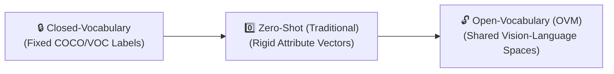

<!-- SEO Meta Tags
description: A curated list of Awesome Open-Vocabulary Models (OVMs). Explore the evolution, methodology, modalities, and production applications of open-vocabulary vision models.
keywords: open-vocabulary models, OVM, zero-shot learning, vision-language models, CLIP, object detection, semantic segmentation, AI, machine learning
-->

  

 

  

# 🌟 Awesome-Open-Vocabulary-Models
## 🚀 Open-Vocabulary Models (OVMs): Evolution, Variants, & Applications

Open-Vocabulary Models represent a paradigm shift in computer vision and scene understanding. Traditional vision models are constrained to a "closed vocabulary"—meaning they can only detect, segment, or classify a pre-defined, fixed set of categories they were explicitly trained on. Open-Vocabulary Models break these limitations by leveraging a shared vision-language space, enabling them to recognize, localize, and reason about completely novel, unseen objects using arbitrary natural language descriptions at inference time. 🧠✨

---

## 📅 1. The Chronological Evolution

The progression of vocabulary flexibility in vision models maps a clear transition from strict categorical constraints to fluid, language-driven scene understanding. 📈
                    

| Era | Period | Description | Year | Seminal Paper |
|-----|--------|-------------|------|---------------|
| **🔒 Closed-Vocabulary Era** | ~2012–2020 | Relying on heavily annotated bounding boxes or pixel masks for explicit datasets (e.g., ImageNet, MS-COCO, Pascal VOC). The model fails to generalize if an object lacks a predefined numerical index. | 2012 | [ImageNet Classification with Deep Convolutional Neural Networks (AlexNet)](https://papers.nips.cc/paper/2012/hash/c399862d3b9d6b76c8436e924a68c45b-Abstract.html) |
| **0️⃣ Traditional Zero-Shot Era** | ~2018–2021 | Evaluated models on unseen classes by mapping visual features onto hand-crafted intermediate attribute vectors or static word embeddings (like Word2Vec). Suffered from poor localization and low accuracy on complex, real-world novel classes. | 2018 | [Zero-Shot Learning — A Comprehensive Evaluation of the Good, the Bad and the Ugly](https://arxiv.org/abs/1707.00600) |
| **🔓 Modern Open-Vocabulary Era** | ~2021–Present | Unlocked by scaling Vision-Language Models (VLMs) like CLIP. Models utilize weak supervision from massive image-caption text crawls. The fixed categorical classification head is entirely replaced by a text-embedding projection layer, making visual recognition behave like an open conversation with the model. | 2021 | [Learning Transferable Visual Models From Natural Language Supervision (CLIP)](https://arxiv.org/abs/2103.00020) |

---

## 🛠️ 2. Methodology & Weak-Supervision Variants

The underlying architecture dictates how open-vocabulary engines ingest weak supervision signals (like image-text pairs) to map text to region coordinates. ⚙️

| Variant | Mechanism | Example | Year | Seminal Paper |
|---------|-----------|---------|------|---------------|
| **🧩 Visual-Semantic Space Mapping (Dual-Tower Matching)** | Project region proposals or object patches straight into the embedding space of a pre-trained language tower. | Models like **OWL-ViT** or **OWLv2** align image patch tokens with textual prompt embeddings, bypassing explicit box classes entirely. | 2022 | [Simple Open-Vocabulary Object Detection with Vision Transformers (OWL-ViT)](https://arxiv.org/abs/2205.06230) |
| **👩‍🏫 Knowledge Distillation (Teacher-Student Training)** | A traditional, tightly bounded object detector (the student) is trained to mimic the open-ended semantic response vectors of a massive foundation model (the teacher VLM) on localized bounding boxes. | — | 2022 | [Open-vocabulary Object Detection via Vision and Language Knowledge Distillation (ViLD)](https://arxiv.org/abs/2104.13921) |
| **🏷️ Pseudo-Labeling & Generation** | Employs a text-to-image generator or captioner to automatically synthesize novel training images or generate text labels for unannotated object pixels in the wild. | **Grounding DINO** uses text prompts to pseudo-label open-ended target images with absolute bounding coordinates. | 2023 | [Grounding DINO: Marrying DINO with Grounded Pre-Training for Open-Set Object Detection](https://arxiv.org/abs/2303.05499) |

---

## 🎯 3. Modality & Task Types

Open-vocabulary traits have scaled past standard image classification, mutating into dense spatial and multi-dimensional tracking variants. 🌐

| Modality | Task | Behavior | Year | Seminal Paper |
|----------|------|----------|------|---------------|
| **📦 Open-Vocabulary Detection (OVD)** | Localization + Classification | Returns bounding boxes for arbitrary textual inputs (e.g., "vintage ceramic teapot") instead of generic parent labels (e.g., "cup"). | 2021 | [Open-Vocabulary Object Detection Using Captions (OVR-CNN)](https://arxiv.org/abs/2011.10678) |
| **🖌️ Open-Vocabulary Segmentation (OVS)** | Pixel-Level Masking | Isolates exact object contours based on language inputs. Popularized by combining regional grounding with foundation architectures, such as the **Grounded-SAM (Segment Anything Model)** pipeline. | 2022 | [Language-driven Semantic Segmentation (LSeg)](https://arxiv.org/abs/2201.03546) |
| **🏙️ Open-Vocabulary 3D Scene Understanding** | Volumetric Spatial Grounding | Ingests lidar or depth point clouds, segmenting specific objects or vectorized floorplans inside dynamic real-world architectural scans using variable text commands. | 2023 | [OpenScene: 3D Scene Understanding with Open Vocabularies](https://arxiv.org/abs/2211.15654) |

---

## 💼 4. Production Applications

The ability to parse custom phrases without explicit downstream model retraining makes OVMs a crucial choice for specialized enterprise pipelines. 🏭

| Application | Description | Year | Seminal Paper |
|-------------|-------------|------|---------------|
| **🔍 Zero-Shot Defect Detection in Manufacturing** | Traditional vision systems fail when encountering unknown, rare defects. Open-vocabulary models can actively screen a product assembly line for "micro-fractures," "discoloration," or "dents" via dynamic text prompts without requiring prior defect image annotations. | 2023 | [WinCLIP: Zero-/Few-Shot Anomaly Classification and Segmentation](https://arxiv.org/abs/2303.14814) |
| **🤖 Autonomous Robotic Manipulation & Navigation** | Permits edge warehouse robots to understand un-indexed sorting tasks. A robot instructed to "find the red plush toy beneath the box" can utilize continuous OVM text-grounding to safely navigate and retrieve highly customized items. | 2022 | [Do As I Can, Not As I Say: Grounding Language in Robotic Affordances (SayCan)](https://arxiv.org/abs/2204.01691) |
| **🛒 E-Commerce Search-to-Image Mapping** | Enhances catalog tagging automatically. OVM systems read millions of uncurated product images and index them with long-tail descriptive metadata (e.g., "bohemian floral-print summer dress"), drastically improving natural language user search performance. | 2022 | [FashionCLIP: Connecting Language and Images for Product Representations](https://arxiv.org/abs/2204.03972) |
